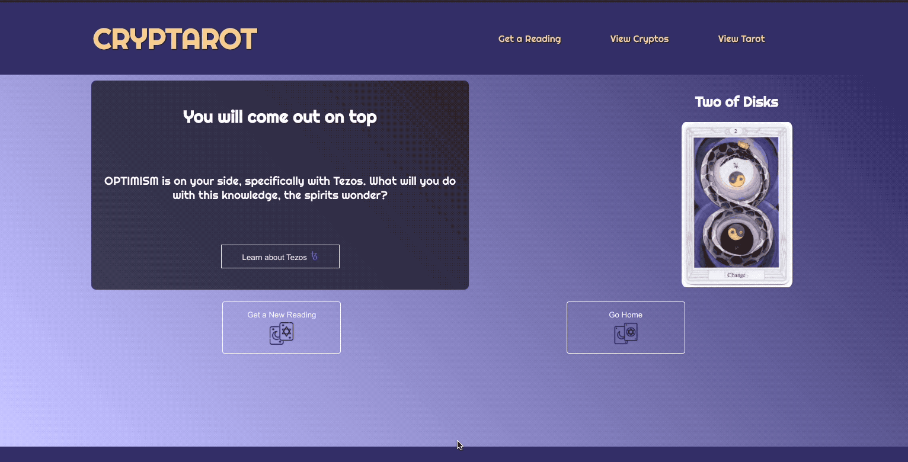

# CrypTarot

## [View this deployed app in action](https://cryptarot.herokuapp.com/)
## [View the Repo for the API created for this project](https://github.com/hoomberto/cryptarot-api)

## Overview

“Investing meets the Occult!”
Consult the spirits and have Tarot cards from the Book of Thoth cast judgment on your financial prospects - should you HODL on DOGE, go all in on BTC, or stay far away from THETA? 

CrypTarot will decipher the deeper meaning from within the cards and guide you to sound financial futures. 

### Disclaimer
*(CrypTarot is not responsible for any resulting gains or losses accrued by the user and is not meant to be used for serious financial decisions or advice)*

CrypTarot is an app meant to appeal to people whose interests are at the crossroads of modern tech (i.e. cryptocurrency) and occult topics (they use the Co-Stars app, enjoy astrology, tarot, witch things). It provides a novel, fun, and educational experience in learning about cryptocurrencies/current exchanges and Tarot card meanings.  

Created with React during Mod 3 of the FE program at the Turing School of Software & Design. This final project revolved around creating a React-based application for a specific, niche audience, along with demonstrating a mastery of React, React Router, Asynchronous JS, and End to End testing with Cypress. 

## Features

- UI that accesses data from [CrypTarot API](https://github.com/hoomberto/cryptarot-api) and [Nomics API](https://nomics.com/docs/) to allow for Tarot readings involving various cryptocurrencies
- On visiting, the site displays the card of the day (which is updated automatically by API at ~4:10PM MST daily) and presented with options to Get a Reading, View Cryptos, and View Tarot
- Tarot Reading: User is able to have a card chosen at random, flip the card, then view the results of their reading. 
- Reading Results: Depending on the card, User will be provided with either one or two cryptocurrencies to invest in, stay away from, consider, and other options. 
- Cryptocurrency data: Following reading, User is able to go to a page that contains further information about the cryptocurrency relevant to their reading, including price and volume changes over time, date of first trade, and a link to purchase the cryptocurrency. 
- Currencies Section - User is able to view recent data on exchanges and search currencies by name or symbol. Each entry has a link that leads to that currency's unique link in the app.
- Tarot Section - User can view all 78 cards present in the Book of Thoth, can click to reveal them one by one, and visit that card's unique page after revealing it. 

## In use

## Set Up

Clone this repo down, and `cd` into it.

Run `npm install`

Run `npm start`

## Tools & Technologies

  
  
  
  

  
  
  
  

## Future Additions
- [ ] Incorporate reverse cards to allow for reverse meanings and even more results
- [ ] Incorporate classic 15-card spread *(Golden Dawn Method)* suggested for use with this particular Tarot Deck *(Book of Thoth)*
- [ ] Allow for multiple card spread that will be able to give more detailed reading 
- [ ] Feature to let user save their unique readings to a “saved-readings” page

## Contributors
<table>
     <tr>
        <td> Bobby Vasquez <a href="https://github.com/hoomberto">GH</td>
    </tr>
    </tr>
    <td></td>
</table>

